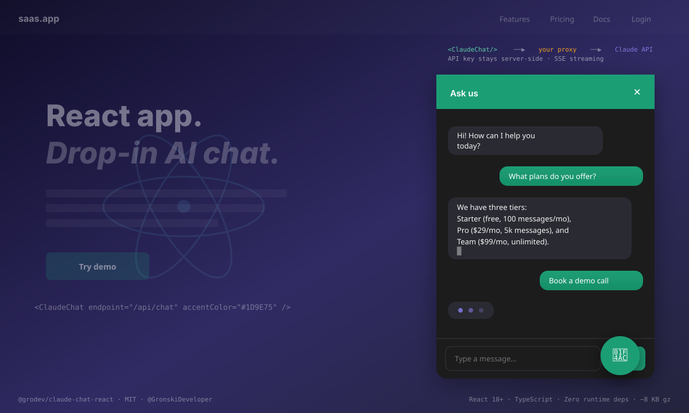

# @grodev/claude-chat-react

[](https://www.npmjs.com/package/@grodev/claude-chat-react) [](LICENSE) [](https://react.dev) [](https://www.typescriptlang.org) [](https://www.anthropic.com/api) [](package.json) [](https://grodev.pl/ai) [](https://fazier.com) [](https://devhunt.tech)

> 🇵🇱 **Praca AI-first (PL).** Ta biblioteka to reactowy odpowiednik mojego [`claude-chat-widget`](https://github.com/GronskiDeveloper/claude-chat-widget) — zbudowana z Claude Code w podejściu AI-first. Threat model (klucz zostaje na serwerze), design API (headless hook + gotowy komponent), a11y, kontrakt typów TS po mojej stronie; boilerplate builda, JSX i CSS Modules po stronie AI. Podział pracy człowiek/AI, weryfikacja i pułapki: [CLAUDE.md](CLAUDE.md). Konfiguracja agenta review: [.claude/commands/react-security-review.md](.claude/commands/react-security-review.md).
>
> 📝 **Read more (EN):** the workflow above is documented in detail — with side-by-side examples from this repo and four other public repos — in [How I document my AI-first workflow in every public repo](https://dev.to/gronskideveloper/how-i-document-my-ai-first-workflow-in-every-public-repo-4l0h) on Dev.to.



A drop-in **React chat widget** powered by the [Claude API](https://docs.anthropic.com/) — a floating launcher + streaming panel, or an inline embed. TypeScript, ~8 KB gzipped, **zero runtime dependencies beyond React**.

The widget talks to *your* server-side proxy — never to `api.anthropic.com` directly — so your API key stays on the server where it belongs.

## Why a proxy?

Your Anthropic API key must **never** ship to the browser — anyone could read it in DevTools and run up your bill. This library calls a small endpoint on *your* server, and that endpoint calls Claude. See [`claude-chat-widget`](https://github.com/GronskiDeveloper/claude-chat-widget) for a working PHP proxy (matches the wire format this library expects). Any language works: Node.js, Python, Go — as long as it exposes the SSE contract below.

```
Your React app (this lib)  ──POST /api/chat──▶  Your server (holds the key)  ──▶  Claude API
        ◀────────── SSE stream of text ──────────
```

## Install

```bash
npm install @grodev/claude-chat-react
```

Peer deps: `react ^18 || ^19`, `react-dom ^18 || ^19`.

## Quick start — drop-in component

```tsx
import { ClaudeChat } from '@grodev/claude-chat-react';
import '@grodev/claude-chat-react/styles.css';

export default function Page() {
  return (
    <ClaudeChat
      endpoint="/api/chat"          // your proxy URL
      title="Ask us"
      greeting="Hi! How can I help?"
      accentColor="#1D9E75"          // your brand color
    />
  );
}
```

That's it — the launcher, panel, streaming, dark mode, and Enter/Shift+Enter are handled.

## Inline mode

If you want the panel to live inside a page section (not float):

```tsx
<ClaudeChat mode="inline" endpoint="/api/chat" title="Support" />
```

## Headless hook — bring your own UI

If you want the state and streaming logic but your own components:

```tsx
import { useClaudeStream } from '@grodev/claude-chat-react';

function MyChat() {
  const { messages, status, sendMessage, stop, reset } = useClaudeStream({
    endpoint: '/api/chat',
  });

  return (
    <>
      {messages.map((m, i) => (
        <div key={i} className={m.role}>{m.content}</div>
      ))}
      {status === 'streaming' && <button onClick={stop}>Stop</button>}
      <input
        onKeyDown={(e) => {
          if (e.key === 'Enter') sendMessage((e.target as HTMLInputElement).value);
        }}
      />
    </>
  );
}
```

## Component props

| Prop | Type | Default | Notes |
|---|---|---|---|
| `endpoint` | `string` | **required** | URL of your proxy |
| `headers` | `Record<string, string>` | — | Merged into every fetch (auth cookies, CSRF) |
| `title` | `string` | `'Chat'` | Panel header |
| `greeting` | `string` | — | First bot bubble shown when the panel opens |
| `placeholder` | `string` | `'Type a message…'` | Input placeholder |
| `accentColor` | `string` | `'#1D9E75'` | Any valid CSS color — theming via one prop |
| `position` | `'bottom-right' \| 'bottom-left'` | `'bottom-right'` | Launcher/panel corner (floating mode only) |
| `mode` | `'floating' \| 'inline'` | `'floating'` | Launcher+toggle vs always-visible embed |
| `initialMessages` | `ChatMessage[]` | `[]` | Seed the conversation |
| `onFinish` | `(assistant: string) => void` | — | Fires after each streamed reply completes |
| `onError` | `(err: Error) => void` | — | Fires on network/upstream errors |
| `className` | `string` | — | Extra class on the root element |

## Wire contract expected from your proxy

`POST` to `endpoint` with body:

```json
{ "messages": [{ "role": "user", "content": "Hi" }] }
```

Response: `text/event-stream` — one frame per token, then `done`:

```
data: {"text": "Hello"}

data: {"text": " there"}

data: {"done": true}
```

On error, the proxy sends `data: {"error": "…"}` and closes the stream. The reference PHP implementation (validation, length caps, CORS, prompt caching, X-Accel-Buffering, error framing) lives at [`GronskiDeveloper/claude-chat-widget`](https://github.com/GronskiDeveloper/claude-chat-widget) — copy the `server/chat.php`, deploy anywhere PHP runs, done.

## Theming

One prop (`accentColor`) covers the common case. For deeper theming, override CSS variables on any parent — they're picked up automatically:

```css
.my-app {
  --cc-bg-override: #1b1b1f;
  --cc-fg-override: #f2f2f5;
  --cc-bubble-override: #2c2c32;
  --cc-border-override: #38383f;
}
```

Dark mode is respected via `prefers-color-scheme` when the overrides aren't set.

## Accessibility

- `role="dialog"` on the panel, `aria-label` on interactive controls.
- `aria-live="polite"` on the message log so screen readers announce new messages.
- `aria-expanded` on the launcher.
- Focus is moved to the input when the panel opens.
- `Enter` sends, `Shift+Enter` inserts a newline.

## Production notes

This is a clean, working foundation. A production deployment usually adds:

- **Rate limiting** on the proxy (Redis, or even a file lock).
- **Restrict CORS** on the proxy to your domain.
- **Retrieval-augmented context** — feed your product catalog / booking system / knowledge base into the system prompt so the assistant answers with *your* data, not general knowledge.
- **Session persistence** — the hook exposes `messages`; you decide where to store/restore them.

That last one is where a chatbot becomes genuinely useful — and it's exactly what I build. If you want an AI assistant wired into your real business data, see **[grodev.pl/ai](https://grodev.pl/ai)**.

## Companion projects

- [`claude-chat-widget`](https://github.com/GronskiDeveloper/claude-chat-widget) — vanilla-JS version + PHP proxy (both halves work together).

## License

MIT.

---

*Made by [Dominik Groński / GroDev](https://grodev.pl) · Poznań, Poland · React · TypeScript · Claude API*
